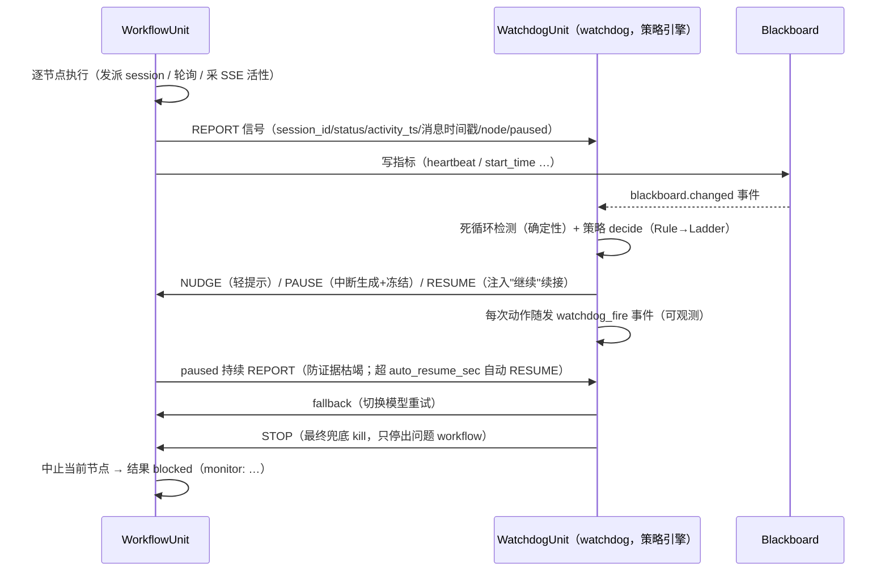

# 架构：从"分层看门狗层"到"对等多状态机网络"（Statechart Network）

> 本文是 regime-driver 的最终架构：对等多状态机网络（看门狗 = 无智能状态机 + 信号协议 + 根不变量运行时强制）。
> 覆盖：信号协议、并行运行时、看门狗单元、根不变量、WorkflowUnit 单线程混合循环 + StatechartDriver 集成、
> 消息机制（线程池/主题订阅/黑板）。这是现行实现的架构真相（完整测试基线见 `README.md`）。

---

## 1. 背景与问题

现行设计（见 `03_boundary.md`）把系统分为**看门狗层**（定死，不可改：
安全监控、确定性门、收敛检测、节点预算）与**用户特化层**（可自定义：角色、策略、
流转、交接模板）。本次质询提出两点反思：

1. **看门狗层不应完全硬编码**：它应是与节点/角色流转相对**正交**的机制——规定每个
   session 工作期间的硬性安全检测（超时、死循环、预算等）。应提供"完整可覆写能力"，
   默认给出一套基本可用的内部策略 + 该策略的可配置参数；开发者通常**不需要**彻底覆写，
   但**能力**必须存在。
2. **"定期外挂 session 探活"的机制欠考虑**：因为"与 session 和智能交互"本质上**也是
   一种状态机**，是一套比节点略高层次的交互策略。不应把它设计为某种"分层守护"，
   而应视为**并行状态机**之间的交互。

---

## 2. 核心构想（形式化）

### 2.1 并行状态机（状态机层面的多线程）

- 系统由**多个对等状态机**组成，状态机之间**没有地位差距**。
- 每个状态机是一个独立执行单元（自带状态、事件、转移、初始态）。
- 状态机之间可以：
  - **完整全面地交换信息**（明确的、结构化的数据交换）；
  - **互相发送消息**；
  - **互相唤起对方的特定机制 / 特定节点 / 特定智能角色判断**。

### 2.2 看门狗层不特殊

- **看门狗层 = 一个没有智能体参与的独立状态机**。
- 它通过信号交互 / 通信交互 / 数据交换，对另一个状态机发送**停止、重试、控制指令**；
  或当另一个状态机进入某回调函数后，发消息给看门狗状态机，看门狗状态机再根据消息回复。
- 因此**"看门狗层"概念被消解**，变成**状态机与状态机之间的交互**。
- 只要设计好"多状态机多线程之间的交互逻辑、权限逻辑、信息信号逻辑"，就能自然书写出
  现看门狗层的一切功能，同时自然允许每个用户自定义自己的看门狗层。

### 2.3 与现有概念的对应（雏形已在代码里）

| 现行实现 | 在状态机网络里的定位 |
|---|---|
| `app/statechart_runtime.py`（ThreadedUnit/Runtime + 信号队列） | 并行状态机运行时的载体 |
| `app/watchdog_unit.py` + `app/watchdog_policy.py`（策略引擎：REPORT→证据→规则→动作阶梯，发 nudge/interrupt/resume/fallback/kill） | 看门狗状态机 |
| `app/workflow_unit.py` + `app/statechart_driver.py` | 有智能体的工作流状态机（单线程混合循环） |
| `app/dialog_control.py`（DialogControlUnit，role=human） | 控制对话框单元 |
| `core/contract.py` 确定性门 | 看门狗状态机的"转移守卫" |
| `infra/ledger.py`（单向审计 JSONL） | 事件日志 |

---

## 3. 现状与构想

下表列出各能力在本架构中的定位：左列为当前实现，右列为该能力在本架构标准下的要求。
除个别明确标注者外两者一致。现行实现的模块真源见 `docs/subsystems/*` 与 `src/regime_driver/`。

| 能力 | 现状（已实现） | 构想所需 |
|---|---|---|
| 状态机数量 | 多个 `WorkflowUnit` 并行（`StatechartCluster`：一个 Runtime 承载多个 workflow） | 多个并行状态机对等运行 |
| 执行模型 | 单线程混合循环（发派线程池 + session 轮询 + 消息队列，见 `WorkflowUnit._dispatch`） | 事件驱动：外部消息可触发转移/回调 |
| 状态机间通信 | `Bus` 双向信号（点对点 / 广播 / 主题订阅）+ `Runtime.post` 异步投递 | 双向消息/信号/数据交换 |
| 互相唤起 | 信号→处理回调（`on_signal` 按消息进入对应处理） | A 可唤起 B 的特定节点/智能判断 |
| 权限/信号逻辑 | 看门狗单元（`watchdog` 角色）按可编程策略发 nudge/interrupt/resume/fallback/kill（`watchdog_policy_json` 可配）；CLI 写操作走 `--perm` 门禁 | 显式授权模型 |
| 看门狗层可覆写 | 用户可注入自定义看门狗状态机；根不变量（I1/I2/I3）仍由运行时强制 | 可注入自定义看门狗状态机 |
| 生命周期 | 单元自治（register/start/stop），`Runtime` 总线协调 | 状态机自治 + 总线协调 |

---

## 4. 可行性评估

### 4.1 理论可行性：高

- 多状态机通过消息/信号复合（parallel / product composition）是标准形式化方法
  （UML Statecharts、CSP、Harel statecharts、automata product construction）。
- "看门狗层 = 无智能状态机 + 对工作流状态机发控制信号"正是"监督控制"
  （supervisory control）理论的标准形态：一个监督器（不可控但可观察+可指挥）叠加在
  被控状态机上，**正交、可替换、可多监督器并联**。这与用户"看门狗层与节点/角色正交"的
  判断高度一致，且有成熟理论支撑。

### 4.2 工程现实与风险

| 风险 | 说明 | 缓解 |
|---|---|---|
| 状态机需"事件驱动" | 现为"推进到 next"，无事件输入口 | 在转移层加"事件/信号触发" |
| 并发执行模型 | 线程/asyncio/多进程选型 | 渐进：先线程+消息队列，保同步 client |
| 消息总线/命令通道缺失 | ledger 只读审计 | 新增双向事件/命令总线（可复用 ledger 格式）|
| 调试/可观测性 | 多状态机并发难调 | 状态快照 + 消息日志 + 每状态机独立账本段 |
| 安全不变量不能弱化 | 可覆写 ≠ 可自毁 | 分离"可覆写策略"与"根安全不变量"（见 §6）|

---

## 5. 方案调研（关键设计维度）

### 5.1 状态机执行模型：遍历器 → 事件驱动单元

现状 `StateMachine` 提供 `next(id)`/`successors(id)` 等遍历方法，`RegimeDriver.run()`
顺序消费。要支持"被另一状态机唤起"，需在状态机单元上增加**事件/信号输入口**：

```
StatechartUnit {
  states, transitions
  on_event(msg)     # 外部消息 → 触发某转移/进入某回调
  send(to, msg)     # 向另一状态机发消息
  emit(event)       # 向总线发事件（供审计/其它状态机订阅）
}
```

### 5.2 并发模型选型

先澄清一个概念：**消息传递模型本身与线程/asyncio 正交**——多状态机依赖的"消息队列/总线"是应用层通信协议，用哪种执行原语承载都成立。真正决定选型的是**并发度、是否需要精确取消、是否愿意改 client 为异步**，而非"消息模型"。

| 模型 | 优点 | 缺点 | 结论 |
|---|---|---|---|
| **线程 + 消息队列** | 兼容现有同步 `OpenCodeClient`/urllib；1 状态机↔1 线程，心智简单；与现有 monitor 线程一致性 | GIL 限 CPU 密集（此处以 I/O 为主，影响小）；无法精确取消 in-flight 阻塞调用（靠 deadline+根不变量兜底）| ✅ **唯一推荐** |
| asyncio | 海量并发轻量；`task.cancel()` 可精确取消阻塞调用 | 需把 client 改异步（大改）；本项目状态机数量少（几个~十几个），高并发优势不显著 | ❌ 降级为**远期备注**（仅当彻底改造纯异步架构时再考虑）|
| 多进程 | 强隔离 | 消息传递成本高、状态共享难 | 不推荐 |

> 备注：asyncio 真正优于线程的仅有"精确取消阻塞调用"一点，但兑现它需重写同步 client，而此场景已用"每段 deadline + monitor abort + 根不变量"兜住，无需为此引入 asyncio。并发模型采用**线程 + 消息队列**。

### 5.2.1 执行模型原则：状态机线程 = 单线程混合循环（硬约束）

**关键前提**：任务发派给 session 后，session 的 LLM 工作由 worker 容器
异步执行，**不占状态机线程**。因此状态机线程保持空闲，空闲时间可用于轮询/收发消息——
这正是状态机间能通信的前提。

**由此的硬约束**：每个状态机线程应是一个**单线程 event/poll 混合循环**，在同一个循环里
同时处理：
1. **已发派 session 的完成轮询**（`read_messages`，快速 HTTP GET）；
2. **消息队列**（来自其它状态机的信号，`q.get(timeout)`）；
3. **定时/超时检测**（deadline、stall 时钟）。

**并消除一切长阻塞调用**。实现采用：
- ✅ **judge 节点不发阻塞长连接**：判定走 `send + 轮询`（`WorkflowUnit._step_judge` 发消息后
  轮询回复），与 agent 节点同构；不再有阻塞式 `ask_and_get_text` 长连接占住线程。
- ✅ **消息驱动循环 = session 轮询**：统一为同一个混合循环——同一循环里处理已发派 session 的
  完成轮询、消息队列（其它状态机的信号）与定时/超时检测，因此"等自己 session 的回复时
  仍能响应他方 STOP 信号"。

### 5.3 状态机间通信：双向事件/命令总线

- **事件总线**（广播/订阅）：状态机发事件（`ts`、`source`、`body`），其它状态机按需订阅。
- **命令/信号通道**（点对点）：A 对 B 发控制信号（`stop`/`retry`/`escalate`/`nudge`）。
- 复用现有 `ledger` JSONL 做**事件日志**，另设**命令队列**做**信号通道**。

### 5.4 消息 → 转移映射（"唤起对方节点/智能判断"）

- 状态机 B 声明"可被唤起的入口"：`on_msg(msg) -> 目标状态/回调`。
- 例如工作流状态机收到看门狗状态机的 `checkpoint_time` 消息 → 进入"自评/交接"回调；
  收到 `stop` → 进入 `aborted` 终态。
- 这使"定期探活"退化为：看门狗状态机定时 `send(workflow, "toward_time")`，工作流在回调里
  回送 `{node, ts, replies}`，看门狗状态机据此检测异常并回发控制信号。**无需"外挂 session"**。

### 5.5 权限 / 信号逻辑

- 每个状态机带**授权角色**（`observer`/`controller`/`governed`）。
- 控制信号（stop/retry/escalate）只允许 `controller` 角色发出；`governed` 只能回事件。
- 根约束由**运行时**强制，而非由某个可覆写状态机强制（见 §6）。

---

## 6. 关键权衡：可覆写 vs 根安全不变量

用户要"可覆写看门狗层"，但原 PLANNING 有"安全不变量不可改写（否则 AI 能关掉自己的监狱）"。
二者表面上矛盾，**实质可调和**：

- **可覆写**：具体检测策略、阈值、判定逻辑、响应动作、甚至"哪一个状态机充当看门狗"。
- **不可覆写（根不变量，由运行时强制，非由某状态机强制）**：
  1. **至少存在一个活跃的看门狗**（无论用户换成哪个看门狗状态机，系统不允许关闭全部看门狗）；
  2. **至少一条"停止/Esc"通道**不可被 AI 关闭（人类永远能强制停机）；
  3. **元迭代上界 / 递归深度上限**（防 AI 通过"自定义看门狗"无限自省失控）。

结论：**"看门狗层可完全覆写"在策略层面可行；但"根不变量"必须从看门狗层剥离，上移到运行时**
——这正是对用户"看门狗层不再特殊"的重构的正确落点。

---

## 7. 架构能力与可验证标准

> 下表列出本架构的各能力及其在 `src/regime_driver/app/*` 中的实现与验证方式；
> 验证以 `python -m pytest` 实跑为准。

| 能力 | 内容 | 可验证标准 |
|---|---|---|
| **状态机泛化** | 把 `StateMachine`/driver 泛化为"事件驱动可交互单元"：加事件/消息输入口、`send/emit/on_event`；新增"消息唤起节点/回调" | 以 `python -m pytest` 实跑为准 + 新增"消息唤起节点"单测 |
| **并行运行时 + 总线** | 引入多状态机调度 + 双向事件/命令总线；状态机 A/B/C 并行，互发消息、互驱 | 多状态机并行 + 消息互驱集成测试 |
| **看门狗状态机化** | 把硬编码 monitor/gate 重写为"无智能看门狗状态机 + 通信协议"；工作流在回调里回送时间戳/回复，看门狗检测并回发 stop/retry/escalate | 原 monitor/gate 全部功能经看门狗状态机重现；安全不变量仍成立；死循环/卡死 E2E 以 pytest 实跑为准 |
| **用户自定义看门狗** | 暴露注册接口：用户可注入自定义看门狗状态机/策略，覆盖默认；根不变量仍由运行时强制 | 用户自定义看门狗状态机端到端；"关掉全部看门狗"被运行时拒绝 |

---

## 8. 决策结论

1. **迁移路线**：渐进（现有同步模型上叠加总线，monitor 升级为看门狗状态机）。
2. **并发模型**：线程 + 消息队列（保同步 client），而非 asyncio（改异步 client）——
   状态机数量少、I/O 密集，asyncio 无显著优势（见 §5.2）。
3. **根安全不变量**：可覆写具体看门狗策略，但保留运行时强制的 3 条根不变量
   （I1/I2/I3 由 `Runtime.start` 强制，见 §6）。
4. **默认看门狗**：保留"内置默认看门狗状态机"（`app/watchdog_unit.py`）作为新用户默认，
   自定义作为可选覆写。

---

## 9. 结论

该架构与监督控制理论（supervisory control）高度一致："看门狗层不特殊，只是无智能体的独立状态机，
通过信号与其它状态机交互"。三条关键决策为：
**(a) 状态机从遍历器泛化为事件驱动单元**、**(b) 引入双向消息/命令总线**、
**(c) 把根安全不变量从看门狗层剥离到运行时**。
---

## 10. 消息/信号机制总览

| 机制 | 位置 | 说明 |
|---|---|---|
| 同步点对点 | `Bus.dispatch` | 同步调目标 `on_signal` |
| 异步点对点 | `Runtime.post` / 单元 `send`（经 `_router`） | 投递到目标队列，看门狗真并行 |
| 异步广播 | `Runtime.broadcast` / 单元 `broadcast` | 投递到所有单元队列 |
| 主题订阅/推送 | `Bus.subscribe/publish` + `StatechartUnit.on_event/subscribe` | `emit` 升级为可订阅主题事件（观测/遥测） |
| 黑板/全局状态 | `app/blackboard.py`（挂到 `Bus.blackboard`） | 线程安全共享键值；变更发 `blackboard.changed` 订阅事件 |
| 消除阻塞 | `WorkflowUnit._dispatch`（`ThreadPoolExecutor`） | 阻塞 `send_message` 丢池线程，混合循环不阻塞、可响应 STOP |
| 审计日志 | `Bus.publish`（保留 `events`） | 所有事件同时记审计 |

### 关键设计约束
- 单元经 `Runtime` 出站信号默认为**异步**（`_router` 注入），保证并行性。
- `subscribe` 需在 `register` 之后（`register` 设置 `unit.bus`）。
- 黑板变更即事件：工作流写指标 → 看门狗/遥测读黑板 + 订阅 `blackboard.changed`。

**一次"看门狗拦截"的完整信号时序（SSE 活性 + 可编程策略 + 中断恢复）**：



> 图例：实线箭头 = 消息/信号，虚线箭头 = 订阅推送事件。看门狗按可编程策略
> （`watchdog_policy_json`）做判定并发出控制信号；NUDGE/PAUSE/RESUME 是非破坏性
> 恢复动作（中断→等待→续接），只有 STOP（kill）是最终兜底且点到点，不影响其它并行 workflow。

---

## 11. 多 workflow 并发 + 可视化

### 多 workflow 并发（`app/statechart_cluster.py`）
- `StatechartCluster`：一个 `Runtime` 承载一个 `WatchdogUnit` + 多个 `WorkflowUnit`。
- 每个 workflow 独立 id，黑板按 `{wid}.{metric}` 隔离；看门狗点到点 STOP 只停出问题的 workflow。
- `add_workflow/submit/run_all(tasks)/wait`；预期并发多个真实任务。

### 可视化（Dialog Control 实时监控）
- `DialogControlUnit`（`app/dialog_control.py`）订阅 `blackboard.changed`/`watchdog_fire`/`NOTIFY`，实时监控运行。
- `regime dialog --live` 提供 REPL：`status`/`watch` 读黑板生成每 workflow 状态与事件流快照。
- 纯被动（订阅推送），不打扰运行。

### 健壮性（slow-judge 应对）
- `Settings.request_timeout`（默认 600s）替代固定 240s，慢 judge POST 不超时。
- `WorkflowUnit._dispatch` 失败重试（3 次 + 退避），丢给池线程不阻塞混合循环。

---

## 12. 语义门 + 节点能力边界 + 运行时验证 + 上下文交接

这四项机制把"确定性流程"从**格式把关**升级为**语义把关 + 结构分工 + 运行时证据**，
并把"会话会疲劳"纳入流程管理。

### 12.1 语义门：ReviewerVerdict.issues

`ReviewerVerdict` 新增 `issues: [{severity: blocking|warning, summary, detail?}]`。
确定性门新增规则：**`advance` 不允许携带未解决的 blocking 级 issue**——审查者不能既列出
"阻塞性问题"又挥手放行（kv_failover-advance 类矛盾被直接拒绝）。`ask_developer` 要求
`message_to_developer` 仍成立。该字段可选（缺省 `[]`），旧审查输出向后兼容。

**人工确认点**：新增动作 `ask_human`（要求 `human_question`，置信度 ≥ 0.6）——
workflow 冻结推进（`human_wait` 相），把问题写黑板 `{wid}.human_ask` 等待对话框裁决
（`decide <wid> <yes|no>`；yes 放行推进、no 回开发者重做带评论）；超时按
`human_confirm_timeout_sec`/`human_default_on_timeout`（默认 block）兜底。事件
`human_ask`/`human_decision`/`human_timeout`/`human_rework`。

### 12.2 节点能力边界：`readonly`

`Node.readonly`：只读节点禁止写/改/删文件（提示词注入"节点能力：本节点为【只读】…"）。
官方模板 `understand`/`read_code` 为 readonly——强制"先理解/设计、后实现"的分工，让 design
门审的是**未实现的方案**而非木已成舟的代码；文件变更只发生在 `implement`/`wrap`。

### 12.3 运行时验证：judge 节点 `verify`

`Node.verify`：**白名单化的容器验证命令（消 RCE）**——只允许
`docker exec {container} <pytest|python|node|bash|sh...> <参数>` 形态，以 **argv** 执行
（`shell=False`，绝无宿主 shell 解释），`{container}` → `settings.worker_container`；docker
组过期时自动回退 `sg docker -c`（再引号化已校验 argv）。进入 judge 节点时驱动执行，把
`rc + 输出尾部` 作为独立运行时证据注入 judge 提示词（`verify_result` 事件留档）。补上
"reviewer 只读、无法真跑测试"的缺口——test 门拿到真实 pytest 结果而非只静态数用例。
**失败是确定性阻断**：`_step_judge` 把一条 blocking 级 issue 程序化注入解析后的 verdict
再进门——审查者即便试图掩盖，`advance` 也必然被门拒绝（其仍可走
`ask_developer`/`request_context`/`report_user` 通道；rework 后 re-judge 会重跑 verify）。
`verify_enabled` 默认 **false**（opt-in，容器内执行面），`preflight`/离线自动关闭；
deep_validate 校验 `verify` 只允许出现在 judge 节点。

### 12.4 上下文预算交接：`context_handover_policy_json`

会话是"会疲劳的人"：上下文窗口将满时质量退化。策略在**节点边界**（节点完成、派发下一节点
前）检查所有角色会话的 token 使用率（此时 token 已 step-结算）：

- < `soft_fraction`：继续，不打扰；
- `soft`..`hard`：询问该会话（独立临时会话自检）——**自我质询预算**（剩余可推进节点数）+
  是否允许同会话续进（CONTINUE/ROTATE/HANDOFF_NOW）；预算 ≥ `min_continue_nodes` 才续进；
- ≥ `hard_fraction`：**强制交接**（不再问）。

交接 = 新会话 + **真实交接文档**（最近 `handover_keep_messages` 条消息 + 当前节点 + 任务 +
最近汇报）+ "【上下文交接】"开头提示词（保持工作区产物与对外契约不变）。每次交接写
`context_handover` 事件（role/usage/kind/forced/reason），可审计。缺省（未配置 JSON）走
各角色 RolePolicy 阈值（`context_threshold_normal/urgent`）的传统路径。
