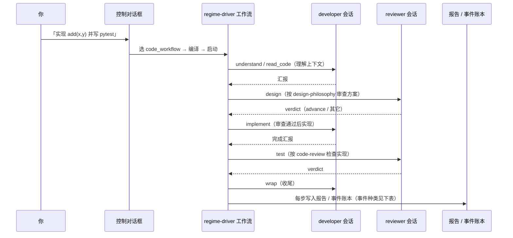
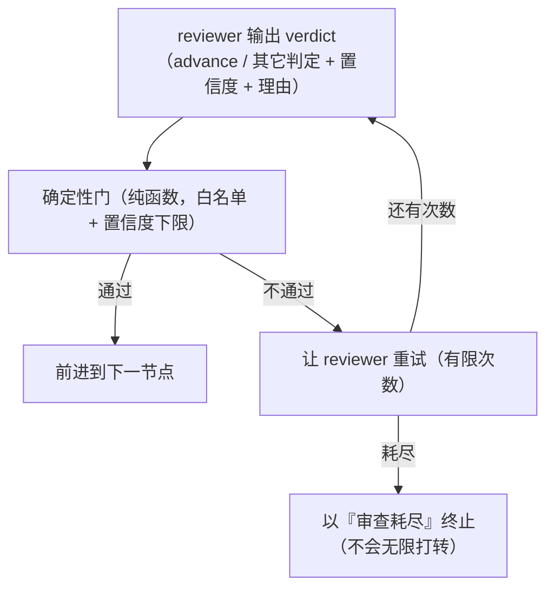

# 控制对话框：regime-driver 的第一入口

> **先读这一篇。** 它解释 regime-driver 最重要的概念：为什么有一个控制对话框，
> 它能带来什么，它是怎么设计的，以及它和整个体系如何配合。
> 读完你应能理解：你主要不是去写配置文件、不是去手写 JSON 流程——而是**和控制对话框对话**，
> 而对话背后，是一整套确定性的角色与流程机制在替你执行。

## 为什么需要控制对话框

在 [首页](../index.md) 我们说过：你想给 opencode 下达"元指令"（"每次写完代码先按质量原则检查"
"进入设计前先做规划分析"……），但这类指令在 LLM 的机制下会随着对话变长而被遗忘。
regime-driver 的解决方案是把元指令**编译成确定性的流程**——让它们一定会被执行。

但一个新的问题出现了：**谁来把元指令编译成流程？** 如果这需要你手写 JSON 流程、记一堆命令参数、
手工配置文件，那使用成本就高到普通人不会用——没人愿意为了用工具先啃一本手册。

**控制对话框的使命**：让使用者**时刻只需要和对话框对话**，就能把元指令变成可执行的制度。
复杂的配置书写、流程规划书写，由对话框替你完成——你描述意图，对话框负责变成流程，
体系负责让流程被 100% 执行。

这三层职责分工（你 → 对话框 → 底层体系）如下：

```
你（人类）                    你只说话："帮我做一个先实现再审查的流程，跑起来"
    │
    ▼
控制对话框（对话 agent）       替你：设计流程、注册、校验、启动、监控、解释
    │
    ▼
regime-driver（底层体系）       编译流程 / 驱动 worker / 进程外监督 / 报告复盘
```

## 它能带来什么好处

| 没有对话框 | 有控制对话框 |
|---|---|
| 要记 20+ 个 CLI 命令和参数 | 用自然语言："看看现在跑得怎么样" |
| 要手写 JSON 流程规格 | 说一句"设计一个先实现再审查的流程"就生成并注册 |
| 要查文档才知道某个命令做什么 | 直接问对话框，它用 CLI 契约回答 |
| 任务卡住了不知道怎么处理 | 对话框帮你查看状态、诊断、给出建议 |

**一句话**：控制对话框把 regime-driver 从"一个需要学习曲线的工具链"变成"一个可以对话的助手"。

## 它是怎么设计的（设计思路）

- **它是独立对话 agent**：不依赖特定 session 管理，所有操作通过一个对话框进行。
- **脑与嘴分离**：
  - **脑**是状态机单元（永不阻塞）——它实时订阅系统总线，知道每个 workflow 的真实状态。
  - **嘴**是对话前端（负责输入输出）——阻塞式 I/O 由 REPL 承担。
- **写操作有权限门禁**：`regime dialog` 默认持有 `run` 级写能力（启动/设计可用）；只读值守用
   `--perm read` 显式降权；程序化构造的对话框单元默认只读。
  安全边界在确定性的后端（**看门狗** = 系统内置的安全看门狗，负责卡死/打转检测，由运行时强制、
  任何自定义配置都无法关闭；**根不变量** = 三条最基本的不可关安全底线），对话框无法绕过。
- **双路可用**：既可以开一个交互式对话窗（`regime dialog`），也可以作为 opencode 里的一个
  `dialog-control` agent（A 路），两者共用同一套 CLI 契约。

## 它有哪些功能

- **对话式监控**：用一句话查看全局态势、某工作流状态、最近事件（`status` / `watch` / `inspect`）。
- **对话式设计流程**：用自然语言描述一个流程，对话框编译并注册为可运行流程（`design`）。
  更进一步，它能设计**完整运行制度**：flow + roles + 监督看门狗 + 上下文交接合一，
  用 `design <名称> <整制度 JSON>` 一句话注册，之后用 `--regime-name` 按名运行。
  这就是**制度一等公民**——一套"怎么跑"的完整规则，作为可注册、可热重载、可分享的命名对象。
- **对话式启动**：说"跑这个流程，做某某任务"，它非阻塞启动并给你编号（`start`）。
- **后台运行与事后查看（核心能力）**：长任务默认非阻塞——提交后立即拿 handle，你继续做别的事；
  之后 `regime job status/logs`（后台输出）、`regime task status/logs`（受监管任务）查看结果，
  **`regime web`** 启动只读观察窗（浏览器 HTML 面板 + JSON API，聚合态势/事件/会话/报告）。
  主控对话框**绝不因某次运行被阻塞**。
- **对话式交互**：和某个 opencode session 单独对话（`talk`）、查看/清理会话（`sessions` / `abort` / `reclaim`）。
- **自检与内省**：`doctor` 检查 worker/密钥/模板就绪，`flow list` / `regime list` 查看已注册流程/制度。
- **扩展你的体系**：对话框能触达用户扩展点——`~/.regime/hooks.py` 统一注入
  hooks（节点进入/完成/审查/停滞/交接等生命周期观察者）+ 看门狗规则 + 自定义工具；
  `hook list/path/reload` 查看与热重载。
- **人工确认点（ask_human）**：审查者需要你拍板时，workflow 会冻结并请你裁决——
  对话框 `decide <workflow> <yes|no> [评论]`（或 `裁决`）应答；无人值守时按超时默认值兜底。
- **自由文本理解**：`--live` 时你可以用自然语言提问，对话框调用模型解释系统状态。

> **两种说话方式，效果一样**：你可以直接输入上面的短命令（如 `status`、`start …`），
> 也可以用一句自然语言（如"现在系统状态怎么样？"、"帮我把刚才的代码检查一遍"）。
> 短命令是"更快的方言"，确定、可脚本化；自然语言则由对话框背后的模型理解并转为命令。
> 教程里用短命令是为了精确演示；日常用哪种随你。

## 值守模式：对话框是"全部能力"的引导枢纽

> regime-driver 的能力不止对话框里那几个命令。对话框的作用是**值守时让你触达全部能力**：
> 随时输入 `capabilities`（或 `cap` / `能力`）查看完整能力地图，按场景分组展示"能做什么 + 怎么触发"。

**何时该打开对话框值守**（而不是只丢任务给 `regime drive`）：

- **任务在跑，你想盯**：`status` / `watch` 实时看进度，`inspect` 看某个 workflow 的指标。
- **流程设计期**：用 `design` 把你的制度流程说出来，`flow list/validate` 检查，然后 `start` 试跑。
- **态势汇总**：`sessions` / `parallel` 看全部会话与工作区；`doctor` 体检。
- **想用 CLI 只看不写**：对话框里的能力地图会指给你 `regime report`（宏观看板）、
  `regime events`（事件账本）、`regime status --deep`（聚合态势）等——这些是对话框外的
  只读命令，值守时可另开终端使用。
- **做质量审查**：挂 analyst/advisor 助手做态势简报或流程设计草案（见下方"与助手配合"）。

**与助手的组合**：对话框可以委派 `analyst`（态势分析师，把原始账本浓缩为发现）与
`advisor`（流程设计顾问，把需求转为 flow 草案）。值守时先让 analyst 摘要、再让 advisor
起草，比人直接读原始数据省力得多。

> **无人值守时对话框在做什么**：对话框是"人值守"时的入口。无人值守长跑（夜间质量套件 /
> 耐久验证）不需要打开对话框——`regime drive` 自带监督栈。两者是同一体系的两面：
> 无人值守靠 supervisor/watchdog 兜底，值守靠对话框触达全部能力。

## 对话背后发生了什么：框架展示

> 这是本篇的核心。理解"你的一句话"是如何变成"一套确定性的角色与节点流程"的。

### 1. 你的指令不会直接下达给一个 agent

当你对控制对话框说"跑 code_workflow，实现某某功能"时，对话框**不会**把你的话原样丢给一个
agent 让它自由发挥。相反，它做的是**制度驱动的规划**：

```
你的编程指令
    │  "实现 add(x,y) 并写 pytest"
    ▼
控制对话框
    ├─ 结合你的编程需求（任务上下文）
    ├─ 结合已有工作流程的全部信息（注册表里的流程定义：code_workflow 等）
    ├─ 结合 regime-driver 的可用能力（驱动/监督/审查/报告）
    ▼
    从制度驱动的角度，规划"如何实现你的指令"
    = 选定流程 → 编译成状态机 → 交给执行体系
```

也就是说：**你的指令是"目标"，流程是"达成目标的制度路径"**。对话框负责把目标接到制度上。

### 2. 流程被编译成状态机：角色与节点出现

选定流程后（比如官方的 `code_workflow`），它被编译成一个**确定性状态机**。每个节点声明：
- **角色**（`role`）：谁来做这一步——`developer`（干活）或 `reviewer`（审查判定）。
- **类型**（`type`）：这一步是什么——`agent`（让角色干活）/ `judge`（判定）/ `tool` / `route` / `gate`。
- **技能**（`skill`）：这一步需要应用哪条规则。

官方的 `code_workflow` 长这样：

| 节点 | 角色 | 类型 | 技能 | 做什么 |
|---|---|---|---|---|
| understand | developer | agent | — | 理解任务上下文 |
| read_code | developer | agent | — | 理解代码上下文 |
| design | reviewer | judge | design-philosophy | 用设计哲学审查方案 |
| implement | developer | agent | developer-quality | 实现（交付前质量自律） |
| test | reviewer | judge | code-review | 用代码审查规则检查实现 |
| wrap | developer | agent | developer-quality | 收尾与清理（交付自查） |

### 3. 会话（session）按角色分配

启动后，体系为**每个角色创建一个专属会话**（session）：
- 一个 `developer` 会话——承载所有"干活"节点的指令。
- 一个 `reviewer` 会话——承载所有"审查判定"节点的指令。

```text
你的话
  │
  ▼
Workflow（状态机单元）
  ├── developer session ◄── understand / read_code / implement / wrap
  └── reviewer  session ◄── design / test
```

每个会话是独立的 opencode 会话，互不串扰。干活的和审查的**不共享上下文**——这正是机制想要的效果：
审查者不看开发者的推理过程，只看"该看的信息"。

### 4. 节点逐个推进：各角色如何配合

流程不是"一次全跑完"，而是**逐节点**推进，每个节点有明确的输入、动作、输出：

```
understand ──► read_code ──► design ──► implement ──► test ──► wrap
   (agent)        (agent)      (judge)      (agent)      (judge)   (agent)
   developer     developer     reviewer     developer    reviewer  developer
```

以一次典型运行为例：

1. **understand / read_code**（developer 干活）：体系给 developer 会话发送指令
   "【当前节点：understand】理解任务上下文：<你的需求>。完成后给出简短汇报：改动文件/测试命令/
   技术债/待决点。" developer 完成并汇报。
2. **design**（reviewer 判定）：体系把 developer 的方案、任务上下文、**以及 `design-philosophy`
   这条技能**，一起发给 reviewer 会话，请它按技能审查方案，给出 `advance`（通过）或其它判定。
   过不了确定性门就**不前进**。
3. **implement**（developer 干活）：审查通过后，developer 在它的工作区实现。
4. **test**（reviewer 判定）：体系把实现结果、**以及 `code-review` 这条技能**发给 reviewer，
   它按代码审查规则检查。
5. **wrap**（developer 收尾）。

把上面 5 步画成一张**时序图**（从上到下为先后顺序，箭头为一条条消息）：



> 图例：实线箭头 = 体系发出的指令（干活或审查），虚线箭头 = 会话的回报。
> 注意干活与审查**交替**出现，且每次都要等审查 verdict 通过才往下走。

**为什么你的元指令能被执行**：因为流程是**编译后的结构**，不是对话里的请求。每个节点
"谁来做、做什么、按什么规则"都是固定的；审查节点不过关就卡住不前进；监督器盯着整条运行。
所以"写完代码先检查"从一句可能被遗忘的话，变成了 `test` 节点里一定会执行的 `code-review` 审查。

**审查判定是闭环，不是一句话**：judge 节点的判定不直接采信，而是先过一道确定性门：



> 图例：边标签 = 门的判定结果；回环边 = 重试。"过不过关"由机制判定，
> 不由 reviewer 自己说了算——这正是确定性门的意义。

### 5. 每个节点记录什么、发送什么

每一步都会写入**报告日志（journal）+ 事件账本（ledger）**，形成可复盘的事实链：

| 事件 | 记录内容 |
|---|---|
| `node_enter` | 进入某节点：哪个节点、什么类型、哪个角色 |
| `node_done` | 节点完成：产出（报告长度） |
| `reviewer_verdict` | 审查判定：verdict / action / 置信度 |
| `advance` | 流转：从哪到哪（或到结束） |
| `outcome` | 整个运行的结果：complete / error / timeout… |

> 三个词别混淆：**ledger** = 工作流每一步的原始事件账本（`regime events --ledger` 读）；
> **journal** = 规范化后的报告日志（`regime report --journal` 读）；**report** = 把 journal
> 汇总成看板的命令。看板、因果链、模板报告都从同一份 journal 派生。

这样你可以随时复盘：任务走了哪些节点、审查判定是什么、为什么这样走——而不是"跑完了但不知道
发生过什么"。

**这些事件连成一条可回放的时间线**：

```text
node_enter ──► node_done ──► reviewer_verdict ──► advance ──► outcome
 进入某节点      节点完成       审查判定           流转       最终结果
```

### 6. 谁在看着：进程外监督与纠正

除了流程本身，还有一个**进程外的监督器**用独立时钟盯着整条运行。它不依赖流程内部，
即使 worker 完全卡死它也能发现——这是它"进程外"的意义（独立时钟，不与被监督者同生共死）。

```text
监督器每轮检查
   ├─ T1 健康：worker 进程活着吗？容器在跑吗？
   ├─ T2 停滞：会话一直 busy 但没有任何新输出，超过阈值了吗？
   └─ 期限：  超过设定 deadline 了吗？
        │  任一命中
        ▼
进程外纠正阶梯（`regime supervisor`，按严重程度升级；与进程内看门狗阶梯并列，
后者更温柔——见下）
   L1 提示(nudge，判定可选) → L2 中止会话(abort) → L3 换模型 → L4 重启容器 → L5 人工介入
```

**进程内还有一个更温柔的"第一道"：可编程看门狗**：配置了 `watchdog_policy_json`
的 soft 动作时，运行中会先 **PAUSE（中断当前生成、保持会话、冻结推进）**，超时自动
**RESUME（注入"继续"让模型自然续接）**，只有最终兜底才 STOP。所以你可能看到任务"被中断
又自己续跑"——这是正常的恢复机制，不是失败。默认策略下停滞则直接终止。详见
`docs/reference/05_dialog_control_contract.md` §4.1。

超时秒数、停滞阈值、策略（`watchdog_policy_json`/`auto_resume_sec`）等都可配置；
日常你不需要知道这些，只要知道**卡死/打转有人管，不用你盯**。

## 为什么 skill 不直接加载进对话框

你可能会问：既然有 `design-philosophy`、`code-review` 这些技能，为什么不直接把它们加载进
控制对话框，让它一直"记住"这些规则？

**regime-driver 的选择是：技能按节点、按角色注入——在需要它的那个节点，注入给那个角色。**

### 这样做的三个原因

1. **上下文是稀缺资源**。把一堆技能常驻在对话框里，会持续占用上下文窗口，挤占真正干活的空间；
   而且对话越长，这些技能越可能被"稀释"遗忘——这正是我们要解决的问题本身。按节点注入，
   只在需要的那一刻出现，用完即走。

2. **角色只需要它该知道的**。developer 干活时不需要背审查规则；reviewer 判定时不需要背
   实现细节。给每个角色**恰好**它需要的技能和信息，它才能产出**有机的、符合工程进度的**反馈——
   而不是被一堆无关规则干扰。

3. **技能与节点绑定，保证一定被应用**。技能写在节点定义里（`design` 节点绑定
   `design-philosophy`），审查发生时**必然**注入——不是"看心情用不用"，而是结构性的。
   这延续了同一哲学：**确定性的归机制，智能的归模型**。技能是什么、何时用，由机制决定；
   模型只需在那个节点、按那份技能、结合它拿到的信息，做出最好的判断。

### 对比：为什么这样比"直接加载进对话框"更有效

| | 技能常驻对话框 | 技能按节点注入角色 |
|---|---|---|
| 上下文占用 | 常驻占用，挤占干活空间 | 用时注入，用完释放 |
| 对话变长后 | 技能被稀释、遗忘 | 结构性绑定，必然应用 |
| 角色专注度 | 每个角色看到全部规则 | 每个角色只看它该用的 |
| 反馈质量 | 受无关规则干扰 | 拿到恰好需要的信息，产出贴合进度的反馈 |

**一句话**：按角色注入技能，是"让每个角色在正确的时间、拿到正确的规则、面对正确的信息"——
这正是它比"一股脑加载进对话框"更合理、更有效的原因。

## 它和 regime-driver 体系如何配合

```
控制对话框（对话 agent）
   │ 用自然语言发指令（监控/设计/启动/交互/自检）
   ▼
CLI 契约（regime 命令，唯一真源）        ← 对话框只说这一种"语言"
   │
   ├─ 编译流程 → 状态机（角色/节点/技能）
   │     └─ 每角色一个 session，逐节点驱动
   │     └─ 审查节点按角色注入技能
   ├─ 驱动 opencode worker 干活
   ├─ 进程外 supervisor 监督（健康/停滞/期限/纠正阶梯）
   ├─ 报告总线（journal + rollup）可复盘
   └─ 多工作区 / 并行任务并发隔离
```

对话框不重新发明能力——它**复用** regime-driver 的全部底层能力，只是把"记命令、写配置"变成了
"说话"。你通过对话框下达意图，体系负责确定性的执行与监督。

## 为什么 worker 是干净的执行器，对话面要装插件

体系里有两类 opencode 角色：**worker**（干活）和**对话面**（控制对话框）。它们的区别不是
偶然，而是架构分层的必然：

| | worker（执行器） | 对话面（控制对话框） |
|---|---|---|
| 启动 | `opencode serve --pure`（**强制无插件**） | 普通 `opencode serve`（**带插件**） |
| 插件 | 零插件 | `regime-dialog-control.js`（把 `regime` CLI 包装成 opencode 原生工具） |
| 职责 | **干净地干活**：被 regime-driver 通过 HTTP 驱动，只执行不自治 | 承载控制对话框，对话载体 |

> **主机 opencode 当主对话框时需要插件**：你直接用主机 opencode 作为主操作对话框（推荐
> 形态）时，`regime setup --workspace <项目>` / `regime scaffold` 会把 `regime-dialog-control.js`
> 部署到 `<项目>/.opencode/plugins/`（工作区模式，推荐）或 `~/.config/opencode/plugins/`
> （全局模式，可选），opencode 启动自动加载，对话框 agent 就能调用 `regime_*` 命令。
> 这个插件是**对话面**需要的，worker 不需要。

**为什么 worker 必须是干净的**：worker 只负责执行，所有"制度"（流程、审查、监督、报告）都住在
regime-driver 这一层，通过 HTTP 驱动它。如果 worker 装了插件，它就有了"自己决定怎么做"的能力——
这恰恰违背"智能负责自由裁量，机制负责确定性约束"的原则。worker 干净，才能保证你的元指令被
流程确定性地执行，而不是被 worker 自己的插件干扰。

**对话面为什么带插件**：对话面是对话层，`regime-dialog-control.js` 只是把 `regime` CLI 命令包装成
opencode 原生工具，让对话框能调用底层命令。它属于"对话载体"，不是"执行器"。**它需要插件，
但 worker 不需要。**

所以：regime-driver 对 opencode 的依赖，全部是它原生提供的 **HTTP REST + SSE API**（session /
message / health / event），在 `--pure`（无插件）下就完整可用。你**不需要**给 worker 装任何插件。

## 你现在应该明白

- 控制对话框是 regime-driver 的**主要使用入口**，不是附加功能。
- 你的指令不是直接下达给一个 agent，而是被**制度驱动地规划**：结合需求、流程、能力，选定制度路径。
- 对话背后是**角色 + 节点**的确定性机制：developer 干活、reviewer 判定、逐节点推进、全程记录。
- **技能按节点、按角色注入**，不常驻对话框——这是上下文、专注度、结构性保证三重考量下的更优解。
- 你能监控 / 设计流程 / 启动任务 / 交互 / 自检，全部通过对话完成。

下一步进入 [快速开始](01_quickstart.md)——用对话完成你的第一个任务。

## 深入指引

- 能力一览（含 `code_workflow` 节点链）：`02_capabilities.md`
- 对话式使用逐步说明：`../howto/dialog-control.md`
- 对话契约细节（查询用）：`../reference/05_dialog_control_contract.md`
- 流程规格结构（查询用）：`../reference/03_flow_spec.md`
- 控制对话框子系统设计：`../subsystems/06_dialog_control.md`
