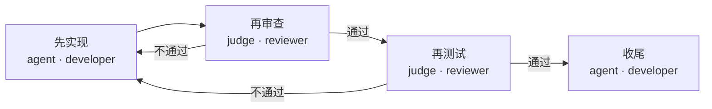

# 设计你自己的流程

> 本篇教你设计一个"属于你"的流程，供后续重复使用。
> 重点是用对话/简单方式表达意图；流程 JSON 的手写细节见查询参考。

## 用对话设计流程（推荐）

在控制对话框里，用自然语言描述你想要的流程：

```text
Dialog> design my_flow 设计一个先实现、再审查、再测试的流程
```

对话框把它编译成流程并注册为可运行（`my_flow`）。之后你可以这样启动它：

```text
Dialog> start my_flow 实现某个功能
```

> **意图级设计**：`design <名称> <自然语言描述>` 由对话框背后的模型把需求翻译成
> 流程 JSON。若需求**明确提到监督/看门狗/人工确认**，它会自动生成一份**完整运行制度**
> （flow + watchdog 等）；若需求只提到"审查前必须跑测试"，则会在对应审查节点加
> `verify`（先跑真实测试再判定），不强制切换整制度形态——你不需要手写这些配置，说出来即可。

## 设计完整运行制度（整制度，推荐进阶）

"怎么跑一个任务"不只包括流程节点，还包括**角色策略、监督看门狗、上下文交接**。
把它们合成一个可命名、可注册、可热重载、可分享的对象，就叫**制度（Regime）**——
制度是一等公民：CLI 用 `regime regime design <名称> '<整制度 JSON>'` 一句注册
（对话框里则是 `design <名称> <整制度 JSON>`），之后 `regime run --regime-name <名称>`
按名运行。JSON 形状：

```json
{
  "flow": {"entry": "a", "nodes": [{"id":"a","desc":"干","role":"developer","type":"agent"}]},
  "roles": {"developer": {"context_threshold_normal": 0.4}},
  "watchdog": {"soft_sec": 30, "soft_action": "interrupt", "hard_sec": 600},
  "handover": {"soft_fraction": 0.5, "hard_fraction": 0.7},
  "stall_sec": 180,
  "auto_resume_sec": 30
}
```

- 全部组件经同一个编译 + 深度校验门；CLI `regime regime list/inspect/load/reload/rm`
  管理已注册制度（对话框 `regime list/inspect` 查看）。
- 每个可选组件都可以不写（`null`）→ 回退到运行时默认；`--regime-name` 与 `--flow` 二选一，
  `--regime-name` 优先（它自带 flow）。
- 并行入口 `run-many`/`drive-many` 也支持 `--regime-name`，每个成员共享同一套制度。

> 什么时候用整制度：你的规则里含**监督策略**（自动中断/续跑）、**上下文交接**或**角色策略**时，
> 把它们和流程捆成一份可分享的声明，比单独散落配置更自洽。纯流程用 `design` 就够。

## 查看已注册流程与制度

```text
Dialog> flow list        # 已注册流程（内置 code_workflow + 你自己设计的）
Dialog> regime list      # 已注册完整制度（flow+roles+watchdog+handover 合一）
```

## 什么时候需要手写流程 JSON

你只在以下情况需要接触流程 JSON：
- 想精确控制每个节点的类型/角色/条件分支；
- 想分享流程给其他人；
- 想实现复杂的多分支/回环逻辑。

这些情况下，查询 [流程规格](../reference/03_flow_spec.md)（JSON 结构）与
[CLI 流程命令](../reference/01_cli.md)（`flow validate/load/reload`）。

> **设计原则**：绝大多数流程可以用对话表达。JSON 是"精确控制"手段，不是日常使用门槛。

## 节点类型：设计流程的四种积木

流程由**节点**组成，每个节点做一件确定的事。对话设计会自动替你选好，但了解四种类型，
你能把需求描述得更准：

| 类型 | 干什么 | 一句话例子 |
|---|---|---|
| `agent` | 让某个角色干活（默认） | "实现这个功能" |
| `judge` | 让审查者判定过不过关 | "按设计哲学审查方案" |
| `tool` | 执行确定性的检查，不走模型 | "检查报告文件是否存在" |
| `route` | 按条件选择下一步 | "有报告→去审查；没有→先重新生成" |
| `gate` | 硬门禁，必须通过才继续（高级） | "必须已有测试通过才能收尾" |

`tool` 和 `route` 让流程能**根据实际情况分支**，而不是一条道走到黑。
官方示例流程 `verify_then_report` 就是"tool 检查 → route 分支 → 再回环"的结构，
加载方式见 [流程规格：示例流程](../reference/03_flow_spec.md)。

### judge 节点可带 `verify`：审查前跑真实测试

审查判定不一定只靠模型读代码。给 judge 节点声明 `"verify": "docker exec {container} pytest -q"`，
体系会在判定前在 worker 容器里执行该命令，把真实运行结果（通过/失败）作为**独立运行时证据**
一并交给审查者。命令经白名单约束：只允许 `docker exec {container} <pytest|python|node|bash|...>`
形态，argv 不经宿主 shell，从源头消掉任意命令执行面（默认关闭，`verify_enabled: true` 才生效）。

## 一个设计好的流程长什么样

当你对对话框说"设计一个**先实现、再审查、再测试**的流程"，它编译出的成品大致长这样：



> 图例：实线 = 顺序推进；带标签的边 = 审查判定结果；回环边 = 审查不过关，回到前面的
> 实现步骤重做。这里能看到 `agent`（干活）与 `judge`（审查）如何拼成一条可执行路径；
> `tool` / `route` 用于"按实际结果分支"的流程，见上方节点类型表。

## 热重载

流程/制度定义变更后可以热重载到运行中的系统（运行中的任务保持旧快照，不受影响）。
`regime flow reload <name>` 与 `regime regime reload <name>` 都是原子替换：新版本先编译 + 深度校验，
通过才切换；失败保留当前版本。细节见查询参考。

## 扩展你的体系：用户扩展点

除 JSON 声明外，你还可以用 `~/.regime/hooks.py` 扩展体系：自定义生命周期 hooks、
看门狗判定规则与工具。对话框内用 `hook list` / `hook path` / `hook reload` 管理与验证。
完整说明与代码示例见 [统一扩展点](../subsystems/10_extension_points.md)。

## 人工确认点（ask_human）

审查者需要你拍板时，可返回 `ask_human` 检查点：workflow 冻结推进并等待裁决。
对话框用 `decide <workflow> <yes|no> [评论]`（或 `裁决`）应答——`yes` 放行到下一节点，
`no` 带评论回开发者重做后重审；`decide` 单独调用列出所有待决检查点。
无人值守时按 `human_confirm_timeout_sec` 超时 + `human_default_on_timeout` 默认兜底。

## 深入指引

- 流程 JSON 结构与字段：`../reference/03_flow_spec.md`
- 完整运行制度（Regime）设计：`../reference/01_cli.md`（`regime regime` 命令组）
- 对话框命令与人工确认点：`../reference/05_dialog_control_contract.md`
- 流程设计概念：`../guide/00_dialog_control.md`
