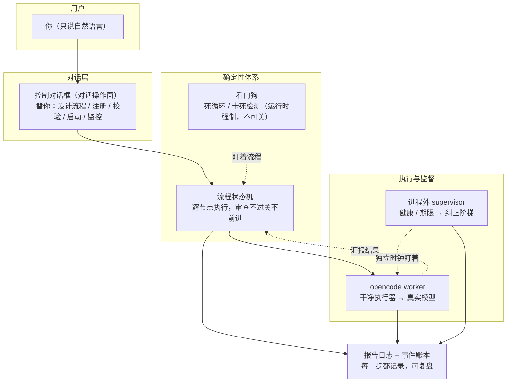

# regime-driver

**让你给 opencode 下达的"元指令"，真正变成一定会被遵守的代码流程。**

> **⚠️ 开发中 / 未发布（Experimental · In Development，当前版本 v0.1）**
>
> 本项目仍处于积极开发中的内部原型，尚无稳定 API 契约。接口可能不兼容变更，不保证向后兼容；
> 未经过外部安全审计。使用本软件造成的任何直接/间接损失，作者概不负责（见 License 与免责声明）。
> 若希望用于生产或作为依赖，请等待正式发布，或先联系维护者。

---

## 一个你可能已经遇到过的困扰

假如你期望给 opencode 下达这样一些指令：

- "每次代码书写完后，根据代码质量原则去检查刚才书写的代码。"
- "以后进入代码设计之前，先做项目规划、方案分析，然后才能进入正式开发。"
- "我希望今天晚上每 30 分钟执行一次特定的代码和文档检查工作，每次做好记录，
  下一次执行要从不同的切入点进行交叉检验。"
- "所有工作都必须遵守特定的 skill。"

这些指令都是**"元指令"——命令之上的命令**：你想给 opencode 的开发流程加上约束，
或者期望它能做一些自主工作。

**问题在于**：在 opencode、很多类似的编程 agent 工具以及 LLM 自身的原理限制下，
这类元指令**不可能被 100% 遵循**。随着运行时长增加、上下文窗口占用率上升，
多轮对话之后，这些元指令会被**部分甚至全部遗忘**。你说了，但它不一定照做。

## 我们的解决方案：regime-driver

**把"运行制度"变成"确定性运行流程"。**

regime-driver 把你的元指令编译成一个**确定性的流程状态机**，在一个干净、无插件的 opencode
worker 上**逐节点驱动**执行。流程不是"建议"，而是**机制**：

- 每个节点是明确的一步，按序推进——不会因为对话长了就跳步。
- 审查节点由只读审查者判定，过不了确定性门就**不前进**。
- 内嵌看门狗盯着卡死与停滞（运行时强制），进程外监督器用独立时钟看着健康与期限——异常自动纠正。
- 每一次运行都被记录——可以复盘"当时为什么这样走"。

一句话：**你说过的元指令，从"对话里的请求"变成"运行里一定会被执行的结构"**。

**整张图长这样**（你只碰顶部那一个框，其余全自动）：



> 图例：实线箭头 = 主流程走向，虚线箭头 = 监督与回报。一个任务 = 状态机按节点推进 +
> 看门狗盯着 + 监督器兜底 + 全程记账，全部自动。

## 而且，你不需要自己写流程

你可能会想："那我是不是要学一套 JSON 流程、记一堆命令？"

**不需要。** 你要做的所有事，仍然只是**和一个 opencode 窗口对话**。

这就是 **控制对话框**——regime-driver 的第一入口：

```
你（只说自然语言）
  │  "设计一个先实现、再审查的流程，跑起来"
  ▼
控制对话框（对话操作面）
  │  替你：设计流程 / 注册 / 校验 / 启动 / 监控 / 解释
  ▼
regime-driver（确定性体系）
      编译流程 / 驱动 worker / 进程外监督 / 报告复盘
```

你描述意图，对话框负责把意图变成制度，体系负责让制度被 100% 执行。

## 核心对比

| | 直接在对话里说"元指令" | 用 regime-driver |
|---|---|---|
| 流程约束 | 多轮后可能被遗忘 | 编译成确定性流程，**必然执行** |
| 审查 | 靠执行者自觉 | 只读审查者判定，过不了门**不前进** |
| 卡死/打转 | 靠人盯 | 进程外监督器自动纠正 |
| 复盘 | 难回溯 | 全程记录，可回放可报告 |
| 使用方式 | — | **仍只是对话**，不写流程 |

## 它能做到什么（对话即可）

- **对话式监控**：一句话看全局态势、任务进度、最近事件。
- **对话式设计流程**：用自然语言描述一个流程（"先规划、再分析、再开发、再审查"），
  对话框编译并注册。
- **对话式启动任务**：说"跑这个流程做某某事"，它启动并跟踪。
- **对话式交互**：和某个工作会话单独对话、查看/清理会话。
- **自检与内省**：检查 worker/密钥/模板就绪、查看已注册流程。
- **自动监督与恢复**：进程外监督器看护健康/停滞/期限，按阶梯自动纠正。
- **多任务与隔离**：同时跑多个任务，每个在独立工作区，互不污染。
- **可复盘**：每次运行写入报告与事件账本。

> 具体用例子快速上手见 [快速开始](guide/01_quickstart.md)；完整能力索引见 [能力地图](capabilities.md)
> （教程视角见 [你能做什么](guide/02_capabilities.md)）。

## 官方提供什么

- **开箱即用的官方模板**：控制对话框配置、审查与执行角色、skills、插件依赖、opencode.json/config——
  随 wheel 打包，`regime setup` / `regime scaffold` 一条命令装配（**推荐工作区模式**：只影响
  当前项目，装进 `<项目>/.opencode/`；全局模式装到 `~/.config/opencode/`，不推荐）。
- **CLI**：`regime` 命令集（run/drive/report/dialog/flow/worker/chaos/doctor/scaffold/setup/uninstall/…）。
- **文档站**：你正在读的这份（用户指南 / 开发者指南 / 参考）。
- **容器配方**（GitHub 仓库，不进 wheel）：`ops/up.sh` 一键构建 + 拉起 worker/控制对话框容器。
- **许可**：MIT License（Copyright © 2026 Nan Shi 施楠）。

---

## 从这里开始

- **我是使用者，想最快用上** → [控制对话框（第一入口）](guide/00_dialog_control.md) 然后 [快速开始](guide/01_quickstart.md)
- **我想理解"为什么要有控制对话框"** → [控制对话框](guide/00_dialog_control.md)
- **我想看全部能力** → [你能做什么](guide/02_capabilities.md)
- **我是开发者**（想理解/扩展它）→ [总体设计思路](architecture/01_principles.md) · [子系统实现](SUBSYSTEM_DESIGN.md) · [流程规格](reference/03_flow_spec.md)
- **我想看边界** → [已知限制](KNOWN_LIMITS.md)
- **我想查技术细节**（命令/配置/JSON）→ [CLI 参考](reference/01_cli.md) · [配置参考](reference/02_configuration.md) · [流程规格](reference/03_flow_spec.md)

> 本站导航按读者分层：**使用者** → "用户指南"（能做什么 + 少量为什么）与"参考"（查技术细节）；
> **开发者** → "开发者指南"。机器专用的内部配置（skills / 控制对话框助手 / workflow-regime）**不在此站点**，
> 保持机器专用。
