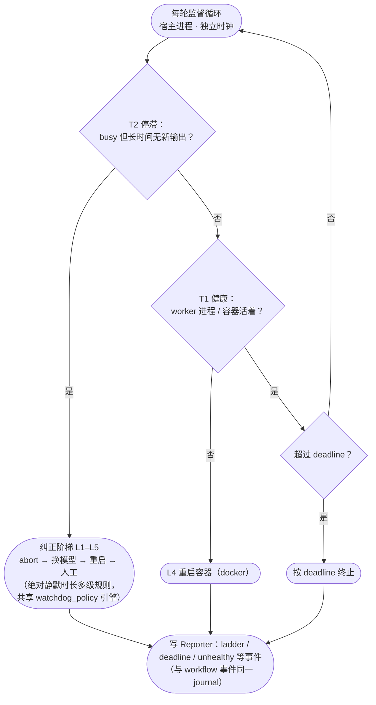

# 进程外监督层架构

> 本文描述 `regime supervisor` 进程外监督层：T1 健康 / T2 停滞 / deadline / 纠正阶梯 / 元分析，
> 消费 worker SSE 事件流进 Reporter。面向需要理解或扩展监督/自愈机制的开发者。

---

## 1. 监督为什么必须是进程外的

监督层承担一组**无法被进程内 regime-driver 替代**的功能，原因是平台限制：被监督进程自身没有
独立时钟（可能与被监督对象同死），也没有 docker 控制权。

| 功能 | 本质 | 归属 |
|---|---|---|
| T1 进程健康轮询 + docker 重启（L4） | 独立时钟、需 docker 控制权 | **进程外**（不能：进程内无独立时钟、无 docker 控制权） |
| T2 会话停滞（busy 但无 SSE 活性）→ 恢复阶梯 | 独立时钟 | **drive 模式归进程内 watchdog**（同用 SSE 活性信号，且能跟随当前 `wait_sid`、执行 pause→resume→fallback→kill 全阶梯）；独立 `regime supervisor` 保留进程外 T2 |
| 期限强制（deadline 永不无限跑） | 独立时钟 | **进程外**（不能） |
| 纠正阶梯 L1–L5（abort/回退/重启/人工） | 编排 | 进程外（独立 supervisor）；drive 模式由进程内策略看门狗的恢复阶梯承担会话级恢复 |
| 元分析（模型判 verdict + 确定性门） | 独立模型复盘 | 可（复用 Reporter/模型调用） |
| 停滞首道防线（进程内 watchdog 策略引擎：SSE 活性 → Rule → 动作阶梯 nudge/interrupt/resume/fallback/kill） | **进程内** | 可 |
| 任务注册表 / 提交接口 | 任务管理 | 可 |

> **活性信号**：停滞判定统一基于 opencode SSE `/event` 事件流
> （`message.part.delta` 等即时推送）——token 计数（`session_tokens`）是 step 粒度
> 记账（processor.ts 在 step-finish 才落账 + 异步 projector 写库），单步长思考期间
> 恒为 0，不能作为流式活性信号。进程内 watchdog 与进程外 supervisor 共用同一
> SSE 活性判定。
>
> **可编程策略**：进程内 watchdog 是策略引擎（`app/watchdog_policy.py`）——
> REPORT 证据 → `WatchdogPolicy.decide`（多规则取最严重；`meta=True` 走智能判定）→
> 动作阶梯（`nudge`→`interrupt`(PAUSE)→`resume`→`fallback`→`kill`，per-session +
> fire-once + `auto_resume_sec` 自动 RESUME）。中断（PAUSE）非破坏性：abort 当前生成、
> 保持会话、冻结推进，RESUME 注入"继续"续接；只有最终 kill 才终止。配置见
> `settings.watchdog_policy_json`。
>
> **判定统一**：独立 `regime supervisor` 的 T2 判定**走同一 `watchdog_policy`
> 规则引擎**（T2 判定由该规则引擎统一裁决，无第二套实现）。
> 引擎统一（Observer→Judge→Actor）：证据 `SessionEvidence` → 规则 → per-session 阶梯 +
> fire-once + 恢复重置全部共享；仅动作词汇按 Actor 能力位声明——进程内走
> `nudge/interrupt/resume/fallback/kill`，进程外走 `abort/fallback_model/restart/human`
> （`Ladder.order` / `WatchdogPolicy.actions` 参数化）。**行为语义重设计**：进程外阶梯
> 由**绝对静默时长多级规则**驱动（`stall_sec`→abort、`2×`→换模型、`3×`→重启、
> `4×`→人工），等效于旧的连续窗口逐级升级，但判定源单一。meta 第二意见为
> **只升不降**（可把确定性动作直接升到 human，但绝不减少——确定性策略是安全下限）。

**结论**：进程外独立时钟监督是架构性必需的。监督功能作为 regime-driver 一等公民（`regime supervisor` /
`regime task`），提供一套统一的进程外监督面。

---

## 2. 目标架构：监督层作为 regime-driver 的一等公民

```
┌────────────────────────────────────────────────────────────┐
│  regime-driver（单一系统，消除双通道）                        │
│                                                            │
│  进程内（worker 内）：                                       │
│    · WatchdogUnit 看门狗（根不变量 I1/I2/I3 强制）       │
│    · WorkflowUnit 状态机驱动                                 │
│    · Reporter 报告总线（journal + rollup，统一真源）          │
│                                                            │
│  进程外（宿主，独立时钟 + docker 控制）★ 新增一等公民：       │
│    · regime_driver.supervisor：                             │
│        T1 进程健康 + L4 docker 重启                          │
│        T2 会话停滞检测（独立时钟）                           │
│        期限强制（deadline）                                  │
│        纠正阶梯 L1–L5                                        │
│        元分析（复用 Reporter 上下文 + 确定性门）             │
│    · 任务模型：regime_driver.task（吸收 oc-task）             │
│        submit/list/status/stop/logs/clean + 只读 web         │
│    · 可编程看门狗策略：Settings.watchdog_policy_json           │
│        （策略引擎，进程内 watchdog 同用）         │
│                                                            │
│  报告总线：监督事件与 workflow 事件统一写入 Reporter           │
│   → `regime report --tasks-dir` 由 Reporter 自身任务视图取代   │
└────────────────────────────────────────────────────────────┘
```

### 2.1 监督层收编原则（避免重蹈"平行系统"覆辙）
1. **单一包内**：`regime_driver.supervisor`、`regime_driver.task` 作为包内模块，而非 `ops/` 独立脚本。
2. **单一真源**：监督事件（T1/T2/deadline/ladder/meta）全部经 `Reporter.ingest` 落同一 journal，
   与 workflow 事件同 schema（复用 `ReportRecord` + 归属键）。不再有独立 `run-ledger.jsonl`。
3. **单一策略**：`Settings.watchdog_policy_json`（可编程看门狗策略）+ 各独立字段
   （deadline/stall_sec/meta_*），进程内 watchdog 与进程外 supervisor 共用同一活性信号
   （SSE 事件流）与策略语义，不再双份。
4. **任务视图**：`regime report` 的任务看板由 `regime_driver.task` 的注册表直接消费（吸收 oc-task），
   不再有两个 derive 逻辑（消除 `oc_tasks._derive` vs `oc-task.derive` 双写）。

### 2.2 明确职责边界（写入文档，防止未来再分裂）
- **进程内**（worker 内）：状态机驱动、会话级停滞监督与恢复（策略看门狗：SSE 活性 → Rule →
  动作阶梯 nudge→interrupt→resume→fallback→kill，跟随 workflow 当前 `wait_sid`，会话旋转不失焦）、
  看门狗根不变量、报告写入。
- **进程外**（宿主，独立时钟）：进程健康/重启（T1/L4）、全局期限、元分析、任务注册表。
  独立 `regime supervisor`（无进程内 watchdog 的场景）仍承担完整 T2 会话停滞阶梯。
  **drive 模式经 `Supervisor.run(supervise_sessions=False)` 关闭进程外 T2**——会话级监督只属于
  进程内策略看门狗（单一职责），进程外只保留它独有的 T1/deadline/meta。这从结构上消除双看门狗
  阈值竞态（外部 T2 以不同 stall_sec 抢先硬 abort，绕过进程内恢复阶梯）与 T2 失焦（外部只盯
  anchor 会话，rotate 后失去当前 wait_sid）。
- 二者通过 **Reporter/journal（唯一事件真源）** 通信，而非各自独立记账；进程内 watchdog 的
  `watchdog_fire` 也写入共享 journal（经 `WatchdogUnit(reporter=...)`），不再只在内存总线可见。
- **单一活性事实源（drive 模式）**：会话级活性判定由进程内 watchdog 基于同一个
  `SseActivity` 采集器（`Drive` 注入 workflow，经 REPORT 携带 `activity_ts`）。进程外
  supervisor 在 drive 模式不参与会话判定（T2 关闭），其 `ingest_events` 只承担把 worker
  事件写入 journal 的可观测性职责（独立 SSE 流）。独立 `regime supervisor`（无进程内
  watchdog）才自己消费 SSE 做 T2——那是唯一会话判定者，不存在双基准。

### 2.3 监督循环（每轮）



> 图例：菱形 = 判定，圆角矩形 = 动作。正常路径每轮回到循环起点；异常路径最终都
> 落到 Reporter 记账（唯一事件真源）。T2 判定经 `WatchdogPolicy.decide`（与
> 进程内 watchdog 同一引擎），动作词汇为进程外能力集 `abort/fallback_model/restart/human`
> （`EXTERNAL_ACTIONS`，`Ladder.order` 参数化）；阶梯逐级升级由绝对静默时长规则驱动
> （`stall_sec`→abort、`2×`→换模型、`3×`→重启、`4×`→人工），恢复（SSE 活性恢复/idle）
> 重置阶梯。meta 第二意见（`--meta`）只升不降。主机模式（无容器）T1 异常时记为
> `unhealthy` 而不重启。**drive 模式**（`supervise_sessions=False`）下 T2 块被跳过，
> 循环只跑 T1 + deadline + meta（会话级停滞与恢复由进程内策略看门狗承担）。

---

## 3. 风险与护栏

- **不先删后建**：现有容器监督是活生产控制面；必须先让新监督层真实验证可用，再退役旧容器监督，最后删文件。
- **真实 E2E 门槛**：新 supervisor 必须真跑一个任务验证 T1/T2/deadline/ladder 后才算完成，不能只单测。
- **单一真源纪律**：新监督事件必须走 Reporter，禁止再开第二个 `run-ledger`。
- **进程外时钟不可省**：T1 健康/L4 重启与全局期限必须留在进程外（独立时钟），绝不能被进程内替代。
- **T2 会话级停滞不双头**：会话级 T2 要么进程内（drive 模式：策略引擎 + 跟随 wait_sid + 完整恢复阶梯），
  要么进程外（独立 `regime supervisor`），**不允许在同一运行里两者并存**（否则不同 stall_sec 的
  双判定竞态会重现）。

---
