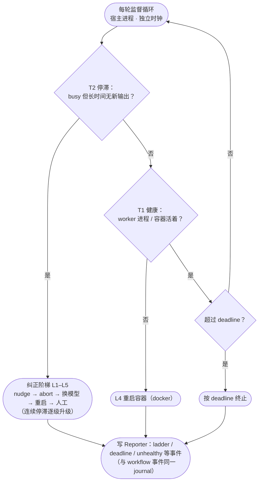

# 进程外监督层架构

> 本文描述 `regime supervisor` 进程外监督层：T1 健康 / T2 停滞 / deadline / 纠正阶梯 / 元分析，
> 消费 worker SSE 事件流进 Reporter。面向需要理解或扩展监督/自愈机制的开发者。

---

## 1. 监督为什么必须是进程外的

监督层承担一组**无法被进程内 regime-driver 替代**的功能，原因是平台限制：被监督进程自身没有
独立时钟（可能与被监督对象同死），也没有 docker 控制权。

| 功能 | 本质 | 能否进程内替代 |
|---|---|---|
| T1 进程健康轮询 + docker 重启（L4） | **进程外**、独立时钟、需 docker 控制权 | 不能：进程内无独立时钟、无 docker 控制权 |
| T2 会话停滞（busy 但无 SSE 活性）→ abort | **进程外**、独立时钟 | 能：进程内 watchdog 同用 SSE 活性信号（WORK_PLAN10） |
| 期限强制（deadline 永不无限跑） | **进程外**、独立时钟 | 不能 |
| 纠正阶梯 L1–L5（abort/回退/重启/人工） | **进程外**编排 | 不能 |
| 元分析（模型判 verdict + 确定性门） | 独立模型复盘 | 可（复用 Reporter/模型调用） |
| 停滞首道防线（SSE 活性停滞检测，进程内 watchdog） | **进程内** | 可 |
| 任务注册表 / 提交接口 | 任务管理 | 可 |

> **活性信号（WORK_PLAN10）**：停滞判定统一基于 opencode SSE `/event` 事件流
> （`message.part.delta` 等即时推送）——token 计数（`session_tokens`）是 step 粒度
> 记账（processor.ts 在 step-finish 才落账 + 异步 projector 写库），单步长思考期间
> 恒为 0，不能作为流式活性信号。进程内 watchdog 与进程外 supervisor 共用同一
> SSE 活性判定。

**结论**：进程外独立时钟监督是架构性必需的。监督功能作为 regime-driver 一等公民（`regime supervisor` /
`regime task`），提供一套统一的进程外监督面。

---

## 2. 目标架构：监督层作为 regime-driver 的一等公民

```
┌────────────────────────────────────────────────────────────┐
│  regime-driver（单一系统，消除双通道）                        │
│                                                            │
│  进程内（worker 内）：                                       │
│    · WatchdogUnit 看门狗（根不变量 I1/I2/I3 强制）       │
│    · WorkflowUnit 状态机驱动                                 │
│    · Reporter 报告总线（journal + rollup，统一真源）          │
│                                                            │
│  进程外（宿主，独立时钟 + docker 控制）★ 新增一等公民：       │
│    · regime_driver.supervisor：                             │
│        T1 进程健康 + L4 docker 重启                          │
│        T2 会话停滞检测（独立时钟）                           │
│        期限强制（deadline）                                  │
│        纠正阶梯 L1–L5                                        │
│        元分析（复用 Reporter 上下文 + 确定性门）             │
│    · 任务模型：regime_driver.task（吸收 oc-task）             │
│        submit/list/status/stop/logs/clean + 只读 web         │
│    · 策略：Settings.policy（吸收 policy.json）               │
│                                                            │
│  报告总线：监督事件与 workflow 事件统一写入 Reporter           │
│   → `regime report --tasks-dir` 由 Reporter 自身任务视图取代   │
└────────────────────────────────────────────────────────────┘
```

### 2.1 监督层收编原则（避免重蹈"平行系统"覆辙）
1. **单一包内**：`regime_driver.supervisor`、`regime_driver.task` 作为包内模块，而非 `ops/` 独立脚本。
2. **单一真源**：监督事件（T1/T2/deadline/ladder/meta）全部经 `Reporter.ingest` 落同一 journal，
   与 workflow 事件同 schema（复用 `ReportRecord` + 归属键）。不再有独立 `run-ledger.jsonl`。
3. **单一策略**：`Settings.policy` 承载 deadline/模型/阈值/重试（吸收 `policy.json`），不再双份。
4. **任务视图**：`regime report` 的任务看板由 `regime_driver.task` 的注册表直接消费（吸收 oc-task），
   不再有两个 derive 逻辑（消除 `oc_tasks._derive` vs `oc-task.derive` 双写）。

### 2.2 明确职责边界（写入文档，防止未来再分裂）
- **进程内**（worker 内）：状态机驱动、turn 级 thinking/停滞首道防线、看门狗根不变量、报告写入。
- **进程外**（宿主，独立时钟）：进程健康/重启、会话级停滞兜底、期限、纠正阶梯、元分析。
- 二者通过 **Reporter/journal（唯一事件真源）** 通信，而非各自独立记账。

### 2.3 监督循环（每轮）



> 图例：菱形 = 判定，圆角矩形 = 动作。正常路径每轮回到循环起点；异常路径最终都
> 落到 Reporter 记账（唯一事件真源）。T2 阶梯中"换模型 / 重启 / 人工"由 `LadderState`
> 限界，一次尝试内至多触发一次；主机模式（无容器）T1 异常时记为 `unhealthy` 而不重启。

---

## 3. 风险与护栏

- **不先删后建**：M0 是活生产控制面；必须先让新监督层真实验证可用，再退役旧容器监督，最后删文件。
- **真实 E2E 门槛**：新 supervisor 必须真跑一个任务验证 T1/T2/deadline/ladder 后才算完成，不能只单测。
- **单一真源纪律**：新监督事件必须走 Reporter，禁止再开第二个 `run-ledger`。
- **进程外时钟不可省**：绝不能为了"省事"把 T1/T2 塞进进程内（那会重蹈"无独立时钟"缺陷）。

---
